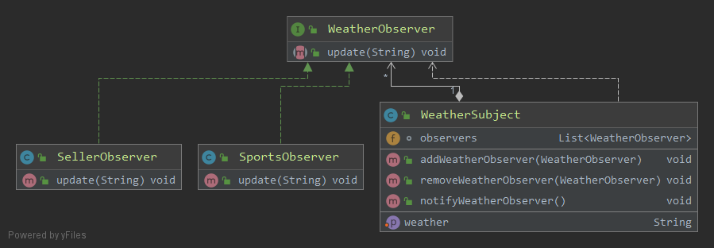
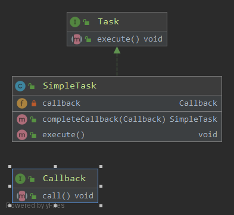

## Observer Pattern
## Applicability
* when an abstraction has two aspects, one dependent on the other. Encapsulating these aspects in separate objects lets you vary and reuse them independently
* when a change to one object requires changing others, and you don't know how many objects need to be changed
* when an object should be able to notify other objects without making assumptions about who these objects are. In other words, you don't want these objects tightly coupled
## Intent

## Callback Pattern
## Applicability
when some arbitrary synchronous or asynchronous action must be performed after execution of some defined activity.
## Intent
